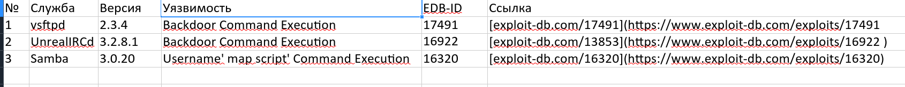

# Домашнее задание: Уязвимости и атаки на информационные системы - Шаров Олег

---

## 📁 Структура проекта

| Папка | Описание |
|-------|----------|
| `metasploitable/` | Файлы виртуальной машины Metasploitable |
| `scans/` | Результаты сканирования nmap |
| `wireshark-captures/` | Дампы сетевого трафика |
| `notes/` | Заметки и дополнительные материалы |

---

## ✅ Задание 1: Сканирование и поиск уязвимостей

### 🧪 Окружение

| Параметр | Значение |
|----------|----------|
| **Гипервизор** | KVM/QEMU (virt-manager) |
| **ОС хоста** | Arch Linux |
| **ОС цели** | Metasploitable 2 (Ubuntu 7.04) |
| **IP-адрес цели** | 192.168.122.12 |
| **Инструмент сканирования** | Nmap 7.98 |

---

### 📊 Вопрос 1: Какие сетевые службы разрешены?

**Всего открыто портов:** 28

| Порт | Служба | Версия |
|------|--------|--------|
| 21 | FTP | vsftpd 2.3.4 |
| 22 | SSH | OpenSSH 4.7p1 Debian 8ubuntu1 |
| 23 | Telnet | Linux telnetd |
| 25 | SMTP | Postfix smtpd |
| 53 | DNS | ISC BIND 9.4.2 |
| 80 | HTTP | Apache httpd 2.2.8 (Ubuntu) |
| 111 | RPC | rpcbind 2 |
| 139 | NetBIOS-SSN | Samba smbd 3.X - 4.X |
| 445 | NetBIOS-SSN | Samba smbd 3.0.20-Debian |
| 512 | exec | netkit-rsh rexecd |
| 513 | login | - |
| 514 | tcpwrapped | - |
| 1099 | Java RMI | GNU Classpath grmiregistry |
| 1524 | bindshell | Metasploitable root shell |
| 2049 | NFS | 2-4 |
| 2121 | FTP | ProFTPD 1.3.1 |
| 3306 | MySQL | MySQL 5.0.51a-3ubuntu5 |
| 3632 | distccd | distccd v1 (GNU 4.2.4) |
| 5432 | PostgreSQL | PostgreSQL DB 8.3.0 - 8.3.7 |
| 5900 | VNC | VNC (protocol 3.3) |
| 6000 | X11 | (access denied) |
| 6667 | IRC | UnrealIRCd |
| 6697 | IRC | UnrealIRCd |
| 8009 | AJP13 | Apache Jserv (Protocol v1.3) |
| 8180 | HTTP | Apache Tomcat/Coyote JSP engine 1.1 |
| 8787 | DRb | Ruby DRb RMI (Ruby 1.8) |
| 35035 | Java RMI | GNU Classpath grmiregistry |
| 36386 | mountd | 1-3 (RPC #100005) |

**Команды сканирования:**
```bash
# Полное сканирование всех портов
nmap -p- -sV 192.168.122.12 -oN scans/basic_scan.txt

# Детальное сканирование с определением ОС
nmap -A 192.168.122.12 -oN scans/detailed_scan.txt
```
### Вопрос 2: Какие уязвимости были обнаружены?
🔴 Три критические уязвимости (для отчёта)


Описание уязвимостей
1. vsftpd 2.3.4 Backdoor
- Тип: Backdoor / Remote Code Execution
- Описание: В версию vsftpd 2.3.4 был встроен бэкдор, позволяющий злоумышленнику выполнить произвольную команду с правами root через специально сформированный запрос на порт 21 (USER-команда с символом :)).
- Критичность: 🔴 Критическая
2. UnrealIRCd Backdoor
- Тип: Backdoor / Remote Code Execution
- Описание: В IRC-сервер UnrealIRCd 3.2.8.1 был встроен бэкдор, позволяющий удалённое выполнение кода через команду AB в IRC-протоколе.
- Критичность: 🔴 Критическая
3. Samba trans2open Overflow
- Тип: Переполнение буфера / Remote Code Execution
- Описание: Уязвимость в Samba 3.0.20 позволяет выполнить произвольный код через переполнение буфера в обработке TRANS2 запросов (CVE-2007-2447).
- Критичность: 🔴 Критическая

---

### Задание 2: Сканирование в разных режимах (в процессе)


